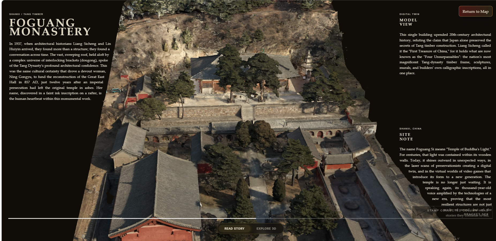
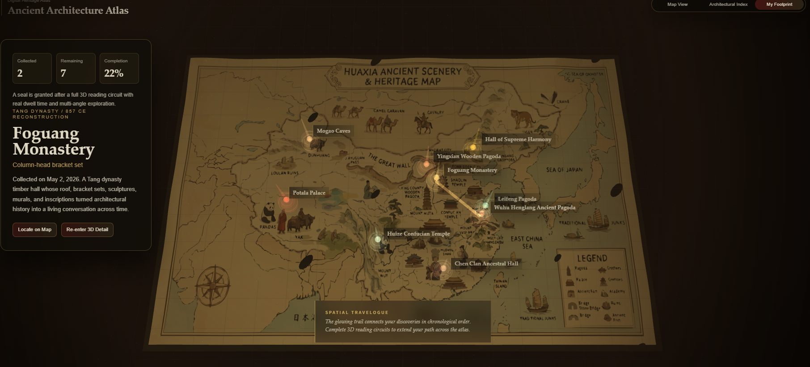

<div align="center">

# 🏛️ ArchAtlas: Ancient Architecture Atlas

**Reconnecting the building to the land, and the story to the space.**




</div>

> **📌 Grading & Review Notice (ENT208):**
> This repository has changed direction. The `main` branch contains the final version of the project. The `old-version-backup` branch preserves the previous project for reference only. Please use `main` for new reviews, deployment, and grading.

## 📖 The Name: Why "ArchAtlas"?

The name is a fusion of **Architecture** and **Atlas**.
For too long, ancient buildings have been studied as isolated structures disconnected from their environment. An *Atlas* represents geography, landscape, and macro-context. By naming it **ArchAtlas**, we embed the physical architecture back into the grand map of Huaxia, allowing users to understand not just how a building stands, but *where* and *why* it stands there.

## ✨ About The Project

**ArchAtlas** is a contour-aware interactive 3D web experience dedicated to Chinese architectural heritage.

We move beyond traditional static text boxes. The project presents a cinematic hand-drawn map of historic sites, lets visitors focus on individual buildings, and opens a detailed 3D view where history literally flows around the live silhouette of each model. It combines high-fidelity 3D rendering with a dynamic typography system to create a digital heritage interface that is both visually striking and highly readable.

## 📱 App Showcase

### 1. The Huaxia Map (Geographic Context)

*Your journey starts on a grand landscape, not a search bar.*



### 2. Dual-Mode Interaction: Read Story & Explore 3D

*Seamless transition from contour-aware reading to immersive 3D exploration.*

<p align="center">
  
  
</p>

## 🚀 Key Features

- **🗺️ Interactive 3D Atlas:** A beautifully rendered map with clickable heritage markers.
- **🏔️ Contour-Aware Typography:** Text layout dynamically responds to and carves around the visible silhouette of the 3D model.
- **🔄 Dual-Mode Viewing:** Easily switch between deep reading and free 3D inspection.
- **🖐️ Immersive Controls:** Intuitive gesture controls for orbiting, zooming, and inspecting complex structures like *Dougong* brackets.
- **⚡ Production Ready:** Highly optimized Vite build configuration, ready for fast CDN deployment.

## 📍 Featured Heritage Sites

- 🏯 **Foguang Monastery**, Shanxi (Tang Dynasty Timber)
- 🏛️ **Huize Confucian Temple**, Yunnan (Qing Ritual Space)
- 🗼 **Wuhu Henglang Ancient Pagoda**, Anhui (Material Memory)

## 🛠️ Tech Stack

- **Core:** Three.js, Vanilla JavaScript (Modules)
- **Layout Engine:** `@chenglou/pretext` for silhouette text-slot carving
- **Build Tool:** Vite
- **Deployment:** Netlify

---

## 💻 Local Setup

1. **Install dependencies**

   ```bash
   pnpm install
   ```

2. **Run the local development server**

   ```bash
   pnpm dev
   ```

3. **Explore locally**

   Open:

   ```text
   http://127.0.0.1:4173/
   ```

   The root page will automatically redirect to the atlas map.

## 📦 Build & Deployment

Create a production build:

```bash
pnpm build
```

Run local checks before pushing:

```bash
pnpm check
```

Preview or upload the generated `dist` folder.

### Netlify Deployment Configuration

The included `netlify.toml` is configured with:

- **Build command:** `pnpm build`
- **Publish directory:** `dist`

> **⚠️ Important Asset Note:**
> The 3D model files are loaded through Vite asset URLs so they are included in the production build. If a model page shows `MODEL LOAD FAILED`, verify that the deployed `dist/assets` folder contains the generated `.glb` files. Do not upload the source folder directly if deploying manually.

## 📂 Key Files Architecture

- `map.html` and `map.mjs`: Power the grand atlas map experience.
- `index.html` and `main.mjs`: Power the 3D detail and dual-mode view.
- `building-data.mjs`: Stores site metadata, historical context, and model references.
- `mask-layout.mjs`: Handles complex text-slot carving around model silhouettes.
- `MODEL_SWAP.md`: Documentation for model replacement and tuning.
